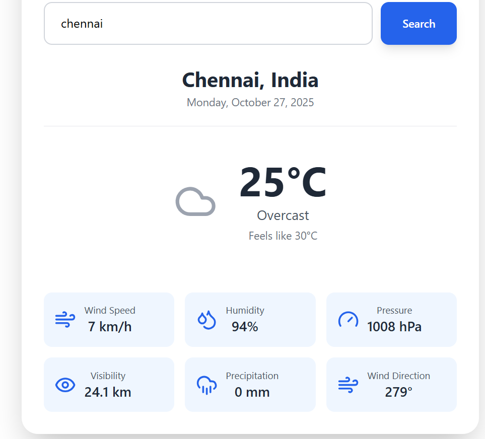

🌤️ Weather Now

Weather Now is a responsive weather web application built using React and Tailwind CSS. It allows users to get real-time weather updates for any city around the world — including temperature, humidity, pressure, wind speed, and more.

🚀 Features

🌎 Search weather by city name

🌡️ Displays temperature, feels like, and conditions (e.g., Overcast, Sunny, etc.)

💧 Shows humidity, pressure, wind speed, and wind direction

🌫️ Displays visibility and precipitation

📅 Shows current date and location

💻 Fully responsive design using Tailwind CSS

🛠️ Tech Stack

React (Vite) – Frontend framework

Tailwind CSS – Styling and responsiveness

OpenWeatherMap API – Weather data provider

Fetch API – For API calls

📸 Screenshots
🌇 Weather Display

⚙️ Installation

1️⃣ Clone the repository
git clone https://github.com/Jey1622/Wheather_Now
cd weather-now

2️⃣ Install dependencies
npm install

3️⃣ Start the development server
npm run dev

4️⃣ Open in your browser

Navigate to:
👉 http://localhost:5173

🧩 API Reference

OpenWeatherMap API Endpoint:

https://api.open-meteo.com/v1/forecast?latitude=${latitude}&longitude=${longitude}&current=temperature_2m,relative_humidity_2m,apparent_temperature,precipitation,weather_code,wind_speed_10m,wind_direction_10m,pressure_msl,visibility&timezone=auto

✨ Example

Search: Chennai
Result:

Temperature: 25°C

Condition: Overcast

Feels Like: 30°C

Humidity: 94%

Wind Speed: 7 km/h

Pressure: 1008 hPa

👨‍💻 Author

Jeyaraman S
Full Stack Developer
 💼 [LinkedIn](www.linkedin.com/in/jeya-raman)